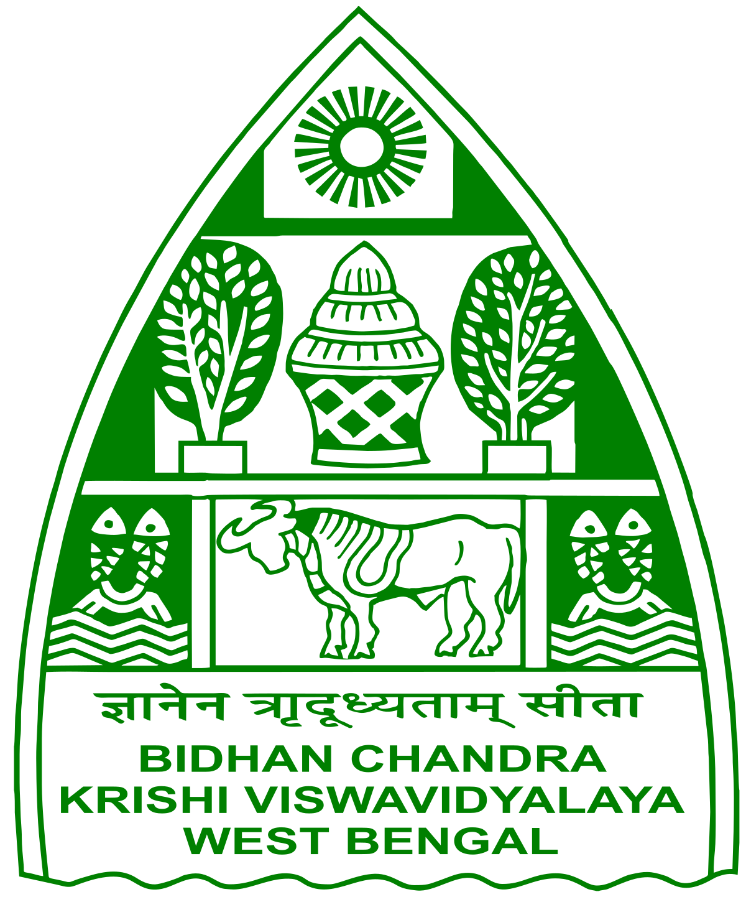

# Education

| | |
|:---:| :---: |
|**Bachelor of Technology (Hons.) (Full Time), 2017**|**Master of Technology (Full Time), 2019**|
|Bidhan Chandra Krishi Vishwavidyalaya, West Bengal|IIT MADRAS, CHENNAI| 
|Full Time|Full Time| 
|{width="40"} |{width="40"} |

=== "BCKV"

    - Earner degree in Agricultural Engineering with the Gold medal
    - Learned in-depth about how modern days technology can help the Agricultural sector
    - NTS scholar (ICAR)

=== "IIT Madras"

    - Programming languages: Python, Matlab, R, and C
    - Degree in Hydraulics and Water Resource Engineering [Civil Engineering]
    - Learned in-depth about how to optimize real-life problems and processes using technological systems
    - Worked on Virgo Supercluster in IIT Madras
    - MHRD GATE scholar
