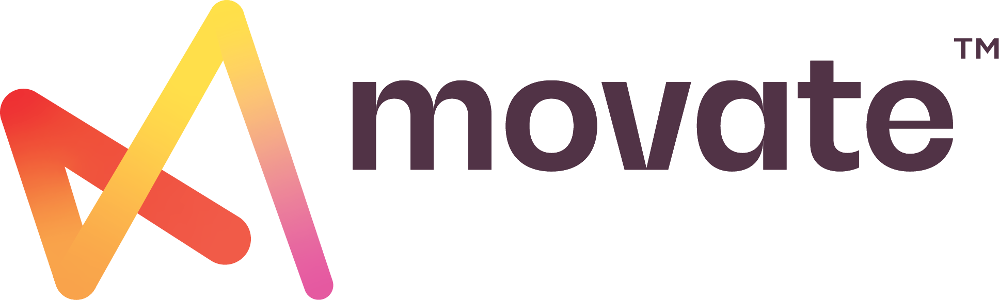

# Overall Industrial Experience : 4 years

| | | | |
|:---:| :---: |:---:| :---: |
|**Teaching Assistant**|**Specialist (Data scientist)**|**Senior Specialist (Data scientist)**|**Research Engineer**| 
|2017 – 2019|2019 - 2021|2021 - 2022|2022 - working| 
|Part Time|Full Time|Full Time|Full Time| 
|IIT Madras|CSS Corp Pvt. Ltd. (R & D), Chennai and Hyderabad|CSS Corp Pvt. Ltd. (R & D), Hyderabad (Rebranded as Movate)|Siemens Technology and Services (R & D), Bengaluru| 
|{width="40"} |{width="40"} |{width="40"} |{width="40"} |

=== "IIT Madras"

    - Assisted Hydraulic Engineering Lab course for B.Tech. (Prof K.P. Sudheer)
    - Assisted in measurement of streamflow in Chennai region using Acoustic Doppler Current Profiler and Current meter (Prof Balaji Narasimhan)
    - Worked as teaching assistant for Contaminant transport modelling course for M.Tech. and Phd. (Prof Srinivasan Venkatraman)
    - Trained students on various computer software
    - Troubleshoot software problems
    - Assignment preparation and correction

=== "CSS Corp"

    - Experience in implementing, developing, deploying production standard AI+ML+DL projects for customer success and innovation lab
    - Experience in working on innovation projects
    - Worked on Cloud platforms like Azure and AWS, in addition to on-premise server
    - Transform idea to the product using python and data science
    - Backend and Analytics work experience with networking device manufacturing client
    - Deep understanding of Contact Center working methodology
    - Built solutions like RNN Chatbot, Smart Routing Manager, Email Classifier, Amazon connect Digital assistant, Visual bot etc

=== "Movate"

    - Worked on predictive analytics which is in use for optimal business decision
    - Experience in working on innovation projects for POC
    - Worked on a cloud platform like Azure, AWS and on-premise server
    - Certified in SRE, AWS and Azure
    - Worked with the International client
    - Worked experience in data analytics platform like Power BI and DOMO
    - Worked on MLOps implementation
    - Expertise in developing and deploying production standard AI-ML models
    - Built solutions like Enterprise search, Coeus prediction, Developer bot, Resume Search

=== "Siemens"

    - Working on Drift detection, Explainable AI, Model monitoring, Active Learning and Computer Vision projects
    - Building solutions using Large Language Models, Prompt Engineering, OpenAI, Hugging Face
    - Working on Verification and Validation of Intelligent system
    - Exploring Trustworthy and Safe AI topics
    - Practicing tools like Airflow, Grafana

